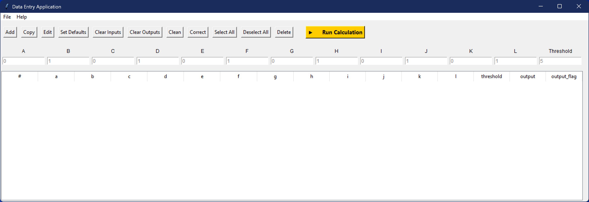

# TkinterGUI-Template

A reusable template for building desktop applications with **Python Tkinter**.  
Originally developed in the context of a research project, it has been refactored into a **generic GUI framework** for managing datasets with inputs, outputs, and customizable calculations.

<p align="center">
  
</p>

---

## ✨ Overview

This application provides a graphical interface to:
- Manage tabular data (add, edit, delete rows).
- Import/export datasets in **CSV** or **Excel** format.
- Perform calculations using a pluggable **machine learning model** (`.pkl` file).
- Validate, clean, and correct input values automatically.
- Use tooltips, scrollable tables, and embedded documentation.

It is designed as a **template**:  
you can keep it as-is to test generic workflows, or replace the calculation engine with your own logic or model.

---

## 🚀 Features

### Input Fields
- Configurable input fields.  
- Default placeholders can be customized and reused.  

### Data Table (Treeview)
- Displays all inputs + calculated outputs.  
- Supports multi-row selection, automatic numbering, and updates.  
- Scrollable with both vertical and horizontal bars.

### Data Management
- **Add / Edit / Copy / Delete** rows.  
- **Clear inputs / outputs**.  
- **Clean** invalid entries or **Correct** them by replacing with defaults.  
- **Set defaults** dynamically.

### Calculations
- Run calculations on selected rows.
- Threshold field is used to flag results.
- Works with a **pre-trained model (`.pkl`)** or any custom Python function.  
- Output includes a numeric result and a status flag (`OK`, `HIGH`, `ERR`).  
- Note: the `.pkl` model is **not provided** in this repository. You must supply or implement your own.

### Import / Export
- Import datasets from **CSV** or **Excel**.  
- Export all data or selected rows.  
- Optionally export **only input columns**.  
- Example dataset can be generated automatically.

### User Interface
- Tooltips on buttons and fields.  
- Row deselection by clicking outside the table.  
- Embedded README viewer inside the GUI.

---

## 📂 File Structure

- `gui_app_tkinter.py` → Main GUI application.  
- `gui_app_functions.py` → Helper functions and calculation utilities.  
- `README.txt` → Help file accessible directly from the GUI.  

⚠️ Files **not included** (you can add your own):  
- `model.pkl` → pre-trained ML model.  
- `normalization_params.csv` → normalization values (if your model requires them).  

---

## 🔧 Installation

Clone this repository:

```bash
git clone https://github.com/yourusername/TkinterGUI-Template.git
cd TkinterGUI-Template
